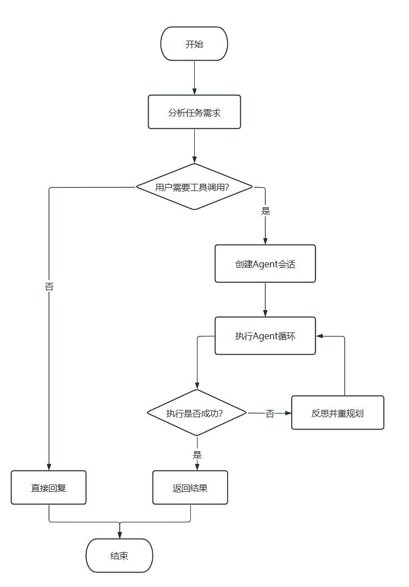
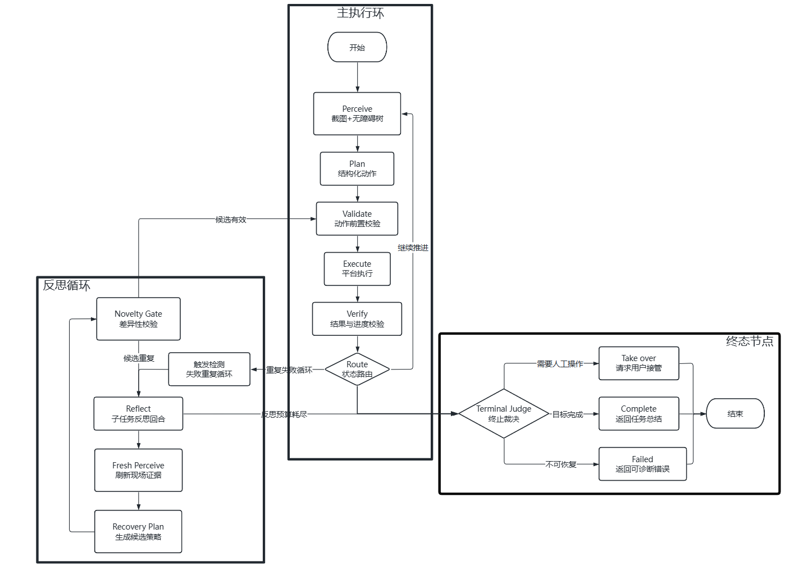

# Umbra phone-agent

Umbra 是一个运行在真实 Android 手机上的任务型 Agent。它既可以直接在主屏上完成任务，也可以通过 Shizuku 在独立虚拟屏中执行任务，让用户不受影响得继续使用主屏。

Android App 使用 Kotlin 编排，配合多模态模型，可以涵盖日常生活中大部分任务。在任务执行过程中遇到有风险或者无法实现的任务，APP将申请用户接管，确保了使用过程中的可靠性和安全性。

## Architecture

### 分层架构



### Agent 状态机



核心能力：

- 主屏与 Shizuku 虚拟屏双平台
- 截图 + 无障碍树 + 前台包名混合感知
- `Launch` / `Tap` / `Type` / `Swipe` / `Back` / `Wait` / `Take_over` 强类型动作
- 导航、闹钟、日历、联系人、短信、邮件、相机等系统工具
- 后置视觉、语义树、包名和输入验证
- 子任务级反思、重复动作检测、候选路径重规划和终局裁决
- 虚拟屏统一接管确认、顶部接管通知、离线中文语音

项目架构详细说明见[详细说明](docs/architecture-v2.md) 

## Deploy

真机要求：

- Android 12 / API 31 或更高
- 启用 Umbra 无障碍服务
- 虚拟屏模式需要 Shizuku 已运行并授权

Shizuku 安装包见：[下载 APK](third_party/shizuku.apk)，详情请参阅[官方仓库](https://github.com/RikkaApps/Shizuku)。

构建并安装调试版apk：

```powershell
cd android

.\gradlew.bat :app:testDebugUnitTest
.\gradlew.bat assembleDebug
adb install -r .\app\build\outputs\apk\debug\app-debug.apk
```

下载并安装正式版apk：
```powershell
$url = "https://github.com/lorz0619-cell/Umbra-phone-agent/releases/download/v2.1.0/Umbra-phone-agent-v2.1.0.apk"
Invoke-WebRequest -Uri $url -OutFile ".\Umbra-phone-agent-v2.1.0.apk"
adb install -r ".\Umbra-phone-agent-v2.1.0.apk"
```


## Environment

下载完成后需要在应用设置里授予必要权限，并且完善环境变量：

| Variable          | Purpose                     | Example                        |
| ----------------- | --------------------------- | ------------------------------ |
| `VLM_API_KEY`     | Provider API key            | user-configured                |
| `VLM_BASE_URL`    | Model provider API endpoint | `https://api.deepseek.com`     |
| `VLM_MODEL`       | Multimodal model name       | `deepseek-v4-flash-vision-exp` |
| `MAX_ACTION_STEPS` | Maximum number of action steps | `40`                         |


## Benchmark

项目提供人为编辑的 52 条真机任务，同时其中8条设置为冒烟集。

冒烟集快速校验：

```powershell
pwsh -NoProfile -ExecutionPolicy Bypass -File `
  .\tools\benchmark\run-benchmark.ps1 `
  -Suite .\benchmarks\suites\benchtask-smoke.json `
  -ValidateOnly
```

benchmark相关说明见[benchmarks/README.md](benchmarks/README.md),三轮结果见[benchmark-three-round-summary.md](benchmarks/benchmark-three-round-summary.md)。

## Debug

实时查看 Agent 决策与验证：

```powershell
.\tools\monitor-agent.ps1 -VerboseTrace
```

## License

[Apache License 2.0](LICENSE)


发布说明见[docs/releases/v2.1.0.md](docs/releases/v2.1.0.md)。
