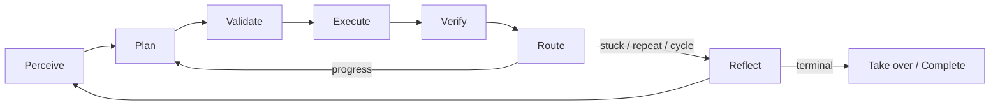

# Umbra phone-agent

Umbra 是一个运行在真实 Android 手机上的任务型 Agent。它既可以操作主屏，也可以通过 Shizuku 在独立虚拟屏中执行任务，让用户继续使用主屏。

Android App 使用 Kotlin StateGraph 编排通用 OpenAI-compatible 多模态模型。动作规划、参数校验、执行、后置验证、反思与熔断都在本地完成。

## Architecture



核心能力：

- 主屏与 Shizuku 虚拟屏双平台
- 截图 + 无障碍树 + 前台包名混合感知
- `Launch` / `Tap` / `Type` / `Swipe` / `Back` / `Wait` / `Take_over` 强类型动作
- 导航、闹钟、日历、联系人、短信、邮件、相机等系统工具
- 后置视觉、语义树、包名和输入验证
- 子任务级反思、重复动作检测、候选路径重规划和终局裁决
- 虚拟屏统一接管确认、顶部接管通知、离线中文语音

## Deploy

真机要求：

- Android 12 / API 31 或更高
- 启用 Umbra 无障碍服务
- 虚拟屏模式需要 Shizuku 已运行并授权

构建并安装：

```powershell
cd android

.\gradlew.bat :app:testDebugUnitTest
.\gradlew.bat assembleDebug
adb install -r .\app\build\outputs\apk\debug\app-debug.apk
```

Benchmark 构建：

```powershell
pwsh -NoProfile -ExecutionPolicy Bypass -File `
  .\tools\benchmark\run-benchmark.ps1 `
  -Suite .\benchmarks\suites\benchtask-smoke.json `
  -BuildAndInstallBenchmark
```

## Environment

模型配置优先在 App 设置中填写。Debug 构建也可以使用 Git 忽略的 `android/local.properties`：

| Variable | Purpose | Example |
|---|---|---|
| `VLM_API_KEY` | Provider API key | user-configured |
| `VLM_BASE_URL` | OpenAI-compatible base URL | `https://api.deepseek.com` |
| `VLM_MODEL` | Multimodal model name | `deepseek-v4-flash-vision-exp` |
| `umbra.apiKey` | Optional local debug key | not committed |

App 会为 Base URL 自动补齐 `/chat/completions`。

## Benchmark

项目提供 52 条真机任务、冒烟集、最终集、随机抽样和人工评分 runner。

快速校验：

```powershell
pwsh -NoProfile -ExecutionPolicy Bypass -File `
  .\tools\benchmark\run-benchmark.ps1 `
  -Suite .\benchmarks\suites\benchtask-smoke.json `
  -ValidateOnly
```

完整说明见 [benchmarks/README.md](benchmarks/README.md)，三轮结果见
[benchmark-three-round-summary.md](benchmarks/benchmark-three-round-summary.md)。

## Debug

实时查看 Agent 决策与验证：

```powershell
.\tools\monitor-agent.ps1 -VerboseTrace
```

完整设计见 [docs/architecture-v2.md](docs/architecture-v2.md)，发布说明见
[docs/releases/v2.1.0.md](docs/releases/v2.1.0.md)。

## License

[Apache License 2.0](LICENSE)
