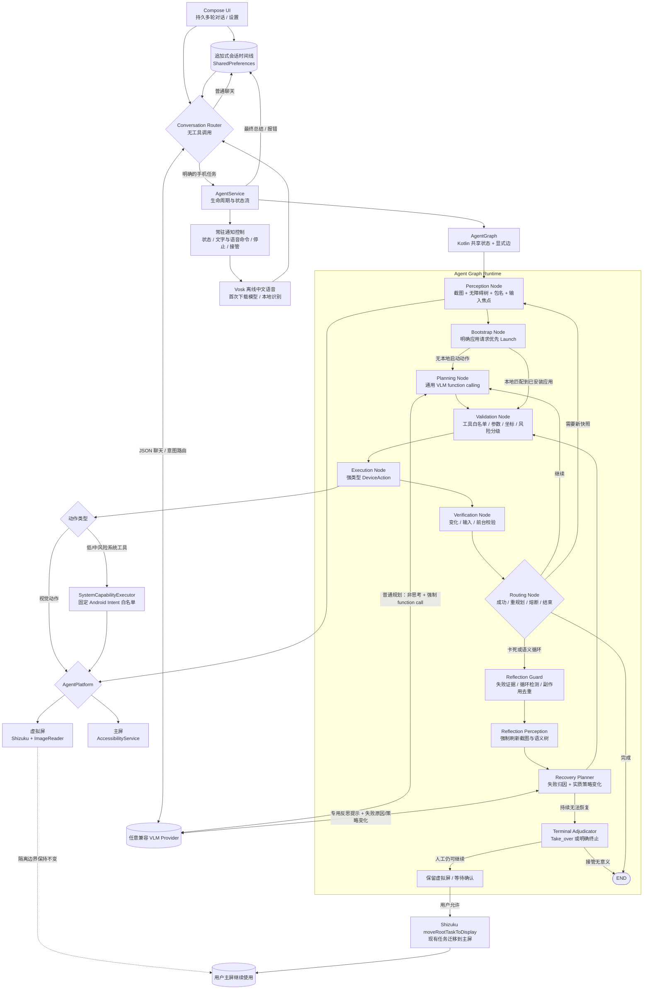
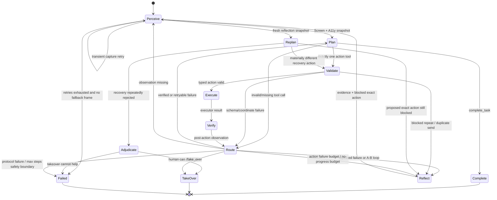

# Umbra phone-agent 2.0 架构

## 设计目标

2.0 将“模型 Agent”改成“本地 Agent Harness”：通用 VLM 只负责根据当前观察选择一个结构化工具；Kotlin 负责状态、动作定义、校验、执行、验证、重试和终止。设计参考 LangGraph 的共享 State / Node / Edge 模型，并吸收 ClosePaw 的薄 Service、独立 turn pipeline、混合感知和动作后观察思路。

## 分层架构

## 状态机

## 共享状态

`AgentGraphState` 是所有节点唯一共享的运行快照，主要字段：

- `task`、`node`、`step`。
- 当前 `PerceptionSnapshot`。
- 模型提出的 `PhoneAction` 与校验后的 `DeviceAction`。
- `ActionResult` 与独立 `VerificationResult`。
- 最近动作历史和上一轮验证反馈。
- 模型的简短决策依据、预期结果、动作前后页面签名。
- 当前稳定子任务 id、该子任务反思次数、待处理的反思证据、禁止重复的页面-动作组合、已发送文本摘要。
- 连续失败计数、重复动作计数、无进展异常信号和最终状态。

每个节点返回 `GraphCommand(state, next)`。运行时用静态 `allowedEdges` 校验跳转，节点不能跳到未声明的阶段。

## 动作协议

模型可调用的手机动作只有：

| Function | Kotlin 类型 | 关键校验 |
|---|---|---|
| `launch` | `PhoneAction.Launch` | 应用名非空；执行器返回目标包名 |
| `tap` | `PhoneAction.Tap` | 优先按无障碍 `element_index` 的 bounds 中心点击；否则校正归一化坐标 |
| type | PhoneAction.Type | 可携带 element_index / target_box 直接绑定输入框；文本长度；输入后回读 |
| `swipe` | `PhoneAction.Swipe` | 起终点有效且不同；时长限幅 |
| `back` | `PhoneAction.Back` | 无参数 |
| `wait` | `PhoneAction.Wait` | 默认 2000 ms；限幅 300..15000 ms |
| `take_over` | `PhoneAction.TakeOver` | 必须说明人工处理原因 |
| `navigate` | `SystemCapability.Navigate` | 目的地非空；出行方式与地图应用白名单；打开路线预览 |
| `set_alarm` / `set_timer` | `SetAlarm` / `SetTimer` | 时间/时长范围；由系统时钟处理 |
| `create_calendar_event` | `CreateCalendarEvent` | ISO-8601 时间；只打开预填确认页 |
| `create_contact` | `CreateContact` | 字段长度；只打开预填确认页 |
| `compose_sms` / `compose_email` | `ComposeSms` / `ComposeEmail` | 收件人与正文长度；只撰写，不发送 |
| `dial_phone` | `DialPhone` | 号码非空；只打开拨号页，不拨出 |
| `open_camera` | `OpenCamera` | photo/video 白名单；只准备，不自动拍摄 |
| `open_url` / `web_search` | `OpenUrl` / `WebSearch` | URL 仅允许 http/https |
| `open_system_settings` | `OpenSystemSettings` | 设置页固定白名单 |
| `share_text` / `play_media` | `ShareText` / `PlayMedia` | 文本长度；通过系统处理器分发 |

`complete_task` 是图控制工具，不会映射为设备动作。

系统工具不是“任意 Intent”接口。模型只能生成 `SystemCapability` 的字段，`ActionValidator` 先做枚举、长度、URL scheme 和时间格式校验，`SystemCapabilityExecutor` 再由 Kotlin 构造固定 action/data/extras。虚拟屏以参数数组调用 `am start --display`，不使用 `sh -c` 拼接模型文本。

风险策略：

- 低风险：闹钟、计时器、打开网页、网页搜索、白名单设置页、媒体播放。Android 执行器确认分发后图直接完成。
- 中风险：导航、日历/联系人新建、短信/邮件撰写、拨号准备、相机和分享。只打开预填或确认界面，不自动产生外部副作用；位于虚拟屏时进入 `Take_over`，由用户决定是否把现有任务迁移到主屏。
- 高风险：删除联系人/日历、直接发送短信、直接拨号等没有注册为模型工具。

## 感知层

1. 平台并行获取当前截图和无障碍树。
2. 截图保留原图用于本地变化指纹；发给 VLM 前最长边缩放到 2560，JPEG 质量 90，减少小图标坐标误差。
3. 无障碍树只保留可见、带标签或可交互的节点，最多 120 个。
4. 每个节点携带文本、描述、resource id、bounds、clickable/editable/focused。
5. 当前包名和聚焦文本与截图一起进入规划上下文。

## 后置验证

- `Launch`：目标包名/前台包名变化或显著视觉变化。
- `Tap`：视觉、语义树、包名或输入焦点变化。
- `Swipe` / `Back`：视觉、语义树或包名变化。
- `Type`：聚焦文本、页面语义树或执行器回读必须包含目标文本。
- `Wait`：等待完成且成功重新感知。
- `Take_over`：暂停图并保留虚拟屏现场，等待用户确认迁移到主屏。
- `SystemTool`：不依赖截图变化自证；必须收到 Android 执行器的 `system_verified=true`。成功的低风险工具直接结束，中风险虚拟屏工具转入接管确认。

验证失败不会让模型自我判定成功；失败原因作为下一次 Planning 的反馈。视觉变化、语义树变化、包名变化和焦点变化都可构成页面进展，避免“tree=true 仍累计无进展”。模型协议失败仍有独立安全预算；设备动作、Tap 定位和连续 8 步无进展都只会触发 Reflection，不再由动作总数直接宣布失败。最大动作步数与模型协议不可用仍是 Kotlin 的最终安全硬边界。

路由层不会再把所有重试直接送回普通 Planning。相同目标第二次点击仍失败，或最近四步形成 A→B→A→B 时，先由 Reflection Guard 固化失败证据和禁止的精确位置桶；随后强制重新获取截图与语义树，再调用专用 Recovery Planner。每个规划动作必须声明稳定的 `subtask`，例如 `submit_search`、`select_store`；恢复阶段不能通过改名逃避计数。当前子任务前 5 次反思都可继续执行纠错方案，第 6 次才调用受限 Terminal Adjudicator，由它判断继续已无意义时选择 `Take_over` 或 `complete_task`。只有在上一动作已验证推进、模型明确切换到下一个子任务时，计数和该作用域的禁止表才清零。

恢复动作必须给出 failure_cause 和 strategy_change，且不能把补字段、改写名称或小幅坐标偏移冒充新策略。被禁止的精确页面-动作仍会在 Validation 前拒绝，但同一语义目标允许在明显不同的位置桶重新尝试。对于消息发送，已验证的文本输入和发送动作形成一次受保护副作用，重复 Type 或无新文本再次发送不会下发到设备。

视觉 Tap 除中心点外还携带归一化 `target_box` 和 `target_description`。执行器以边界框中心为准，再尝试吸附到可交互无障碍节点；模型不得把缩放后图片像素直接当成 0..999 坐标。

动作执行后不再只睡眠一个固定时长。验证节点按动作类型设置初始等待和超时，随后每 300 ms 采集截图与语义树；视觉指纹、包名和树哈希连续两次稳定后才执行后置验证。日志记录实际等待时长、采样数、稳定状态和最后帧差，便于区分“动作没生效”和“页面仍在加载”。

主屏的 Tap/Swipe 会等待 Android `GestureResultCallback` 明确返回完成或取消；仅成功提交手势不再被视为执行成功。

## 虚拟屏边界

`VirtualDisplayAgentPlatform` 仍负责：

- 通过 Shizuku 创建和释放虚拟显示器。
- `ImageReader` 截取虚拟屏画面。
- 截图调用串行化；短暂无帧时延长等待并重新绑定 Surface，仍无新帧时使用最后成功帧降级。
- 每帧携带 frame id、新鲜度、来源和采集时间；无障碍树变化但截图仍为缓存帧时拒绝继续规划。
- 使用 `input -d <displayId>` 定向注入动作。
- 从对应 display 的无障碍窗口读取语义树。
- 虚拟屏 Type 优先直接对目标可编辑节点执行 ACTION_SET_TEXT；模型可直接提供输入框节点或视觉边界，不再要求先 Tap 聚焦。
- 不再调用全局 softKeyboardController.setShowMode(HIDDEN)，避免关闭主屏正在使用的输入法。
- 仅在主屏 IME 未显示时，才允许使用虚拟屏定向点击/剪贴板粘贴兼容回退；主屏正在输入时返回可重试失败，由 Agent Wait 或 Take_over。
- 输入后尽力清除虚拟屏编辑焦点；执行器回读或“定向注入 + 可见变化”共同参与 Type 后置验证。
- 任务结束前停止虚拟屏启动的应用，避免 Activity 回落主屏。
- `Take_over` 是例外：图结束时保留虚拟显示器；用户确认后通过 Shizuku 将当前可见 root task 迁移到物理 Display 0，再释放虚拟屏。迁移失败会保留现场供重试或取消。

图状态机只依赖 `AgentPlatform`，不会绕过虚拟屏平台直接操作主屏。

## UI 与运行状态出口

- 主页面显示持久的追加式多轮对话，先区分普通聊天与明确设备任务；任务运行中只显示简洁状态，结束后只追加最终总结或报错，不暴露后台步骤日志。
- 设置页集中管理目标屏幕、VLM Provider、模型、最大步数、无障碍与 Shizuku 权限。
- 虚拟屏预览位于设置页；步骤、坐标、输入内容和验证数据只通过电脑端结构化日志监视器输出。默认视图压缩为模型依据、动作、预期、执行、验证和反思，-VerboseTrace 可显示完整事件，-OutputPath 可保存原始 JSONL。
- `AgentService` 的 `AgentRunState` 驱动任务中状态和前台通知；持久对话由独立 `ConversationStore` 驱动，避免 Activity 重建或新任务覆盖历史消息。
- 通知使用 Android RemoteInput，可直接输入聊天或任务；运行时提供停止按钮，空闲时可重试上次任务，等待接管时提供确认和取消。
- 主页面与通知动作共享 Vosk 控制器。首次授权必须打开可见 Activity 请求麦克风权限；授权后通知动作启动声明为 `microphone` 的短时前台服务，在后台完成 15 秒收音、离线识别和命令提交，不切换主屏。Vosk 使用官方 `vosk-model-small-cn-0.22`，结果沿用 Conversation Router，因此既支持聊天也支持手机任务。
